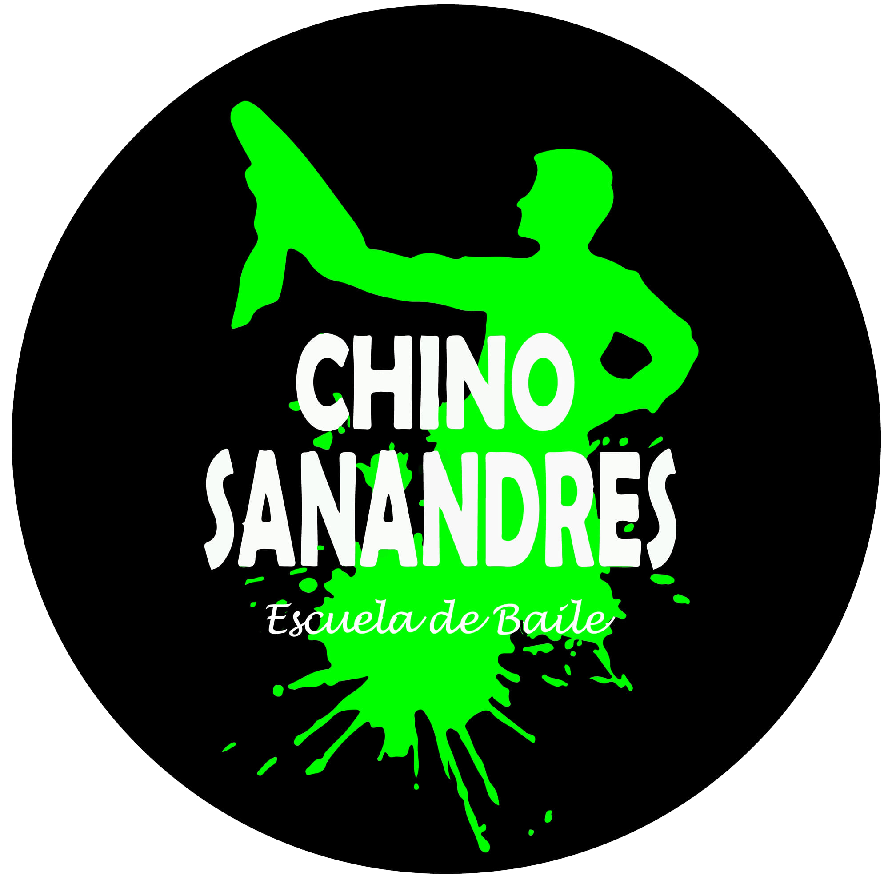

 

### ⭐ Visitas

### 👨🏻‍💻 &nbsp;Sobre mí

Soy un apasionado desarrollador de software con experiencia en diferentes tecnologías y lenguajes de programación. Me encanta crear soluciones innovadoras y aprender nuevas habilidades.

### 🛠 &nbsp;Mis habilidades

&nbsp;
&nbsp;
&nbsp;
&nbsp;
&nbsp;
&nbsp;
&nbsp;
&nbsp;
\
&nbsp;
&nbsp;
&nbsp;
&nbsp;
&nbsp;
&nbsp;
<!--&nbsp;-->
<!--\-->
### ⚙️ Proyectos destacados

Aquí hay algunos de mis proyectos destacados:

|                       Imagen                           |                Nombre               |
| :----------------------------------------------------: | :-------------------------------: |
|          |  <a href="https://github.com/Dark-JuanpiDev/Gestor-de-Inventario.git" style="text-decoration: none;">Sistema de Gestor de Inventario</a>  |
|          |  <a href="https://github.com/Dark-JuanpiDev/Minicarta-Academia.git" style="text-decoration: none;">Minicarta Academia</a>  |

### 🔥 Contacto

Puedes encontrarme en las siguientes redes sociales:

¡No dudes en contactarme si tienes alguna pregunta o colaboración!
